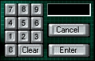



## LoginKeyPad

### Description

!Updated!It is a different of having a login dialog it resembles a high tech security system control panel you can set a limit to the char and if you make it into a ocx you can change the pass code still by looking in its propertys for caption

it can be either in a ocx or hidden in your code you choose and i am open to any surgestions

if you run the code you will see what i am talking about but i got the idea from the tv so technicly the tv should get the code, o yeah the pass code is 23446

thanks to stan amditis for your feed back

it now has "0" and a CLEAR key and it's perfect i hope but i am still open to feed back

!PLEASE VOTE FOR ME!
 
### More Info
 
if you run it you will see what i am talking about but i got the idea from the tv so technicly the tv should get the code, o yeah the pass code is 23446

!PLEASE VOTE FOR ME!

             |
---                |---
**Submitted On**   |2002-07-22 00:29:14
**By**             |[Adam J Zink](https://github.com/Planet-Source-Code/PSCIndex/blob/master/ByAuthor/adam-j-zink.md)
**Level**          |Advanced
**User Rating**    |5.0 (15 globes from 3 users)
**Compatibility**  |VB 6\.0
**Category**       |[Custom Controls/ Forms/  Menus](https://github.com/Planet-Source-Code/PSCIndex/blob/master/ByCategory/custom-controls-forms-menus__1-4.md)
**World**          |[Visual Basic](https://github.com/Planet-Source-Code/PSCIndex/blob/master/ByWorld/visual-basic.md)
**Archive File**   |[LoginKeyPa1226588262002\.zip](https://github.com/Planet-Source-Code/adam-j-zink-loginkeypad__1-38180/archive/master.zip)

